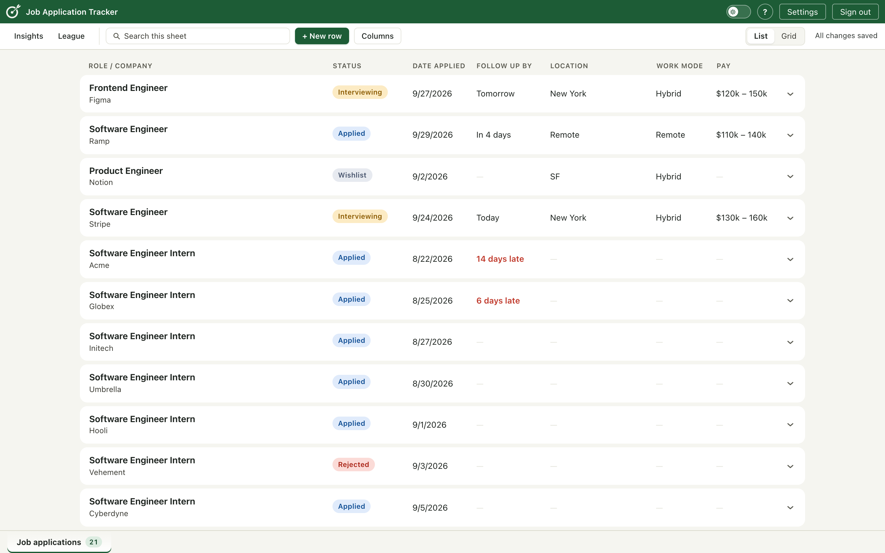
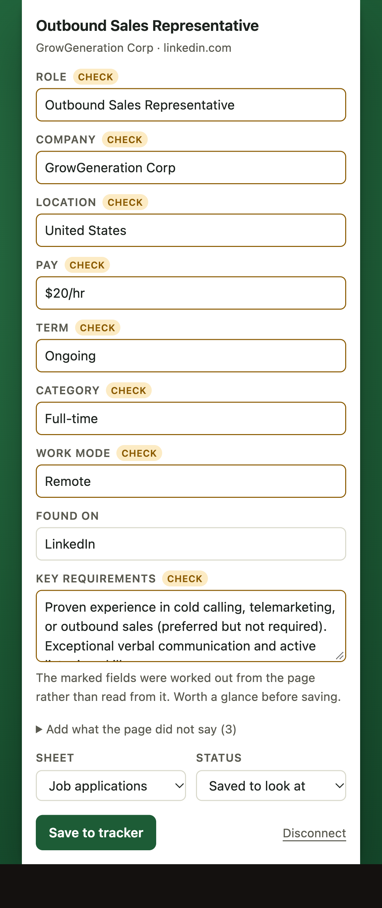
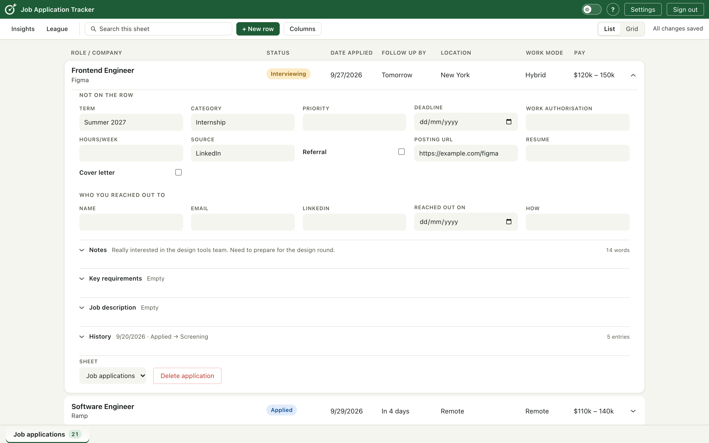
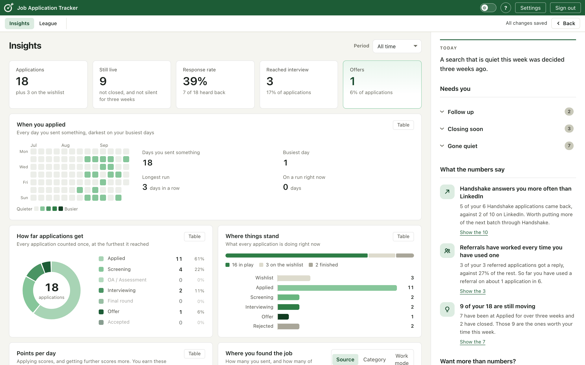
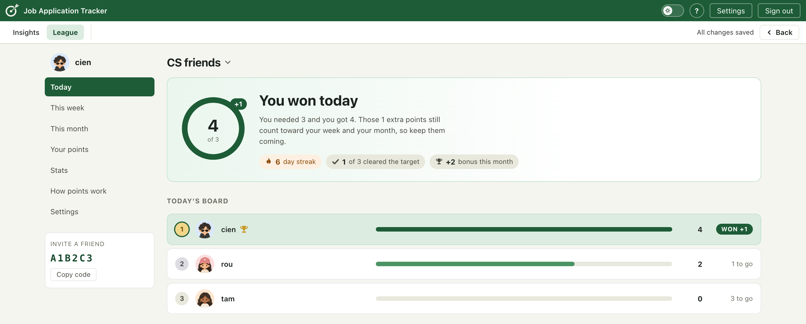
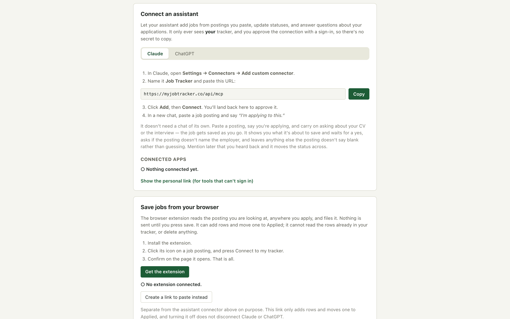

# Job Application Tracker

A job search tracker for students. Live at **[myjobtracker.co](https://myjobtracker.co)**.

A job search generates a lot of small facts: where you applied, what the pay
was, who replied, what you said you would follow up on. Spreadsheets hold them
badly and job boards do not hold them at all. This holds them, and tries never
to make you type one twice.



## Three ways a posting gets in

1. **The Chrome extension.** One click on a posting reads the role, company,
   location, pay and work mode off the page and saves the row.
   [Published to the Chrome Web Store](https://chromewebstore.google.com/detail/bnmemnhbjchapcpjkdlncfghhmgnpmdo),
   Manifest V3, nine applicant tracking systems: LinkedIn, Indeed, Greenhouse,
   Lever, Workday, Ashby, Handshake, Glassdoor and ZipRecruiter.
   

   CHECK marks the fields the extractor worked out rather than read off the
   page, so you know which ones to glance at before saving.

2. **An AI assistant.** The tracker is an MCP server behind its own OAuth 2.0
   authorization server, so you can paste a posting into a chat you were having
   anyway and say you applied.
3. **By hand**, in a sheet that behaves like a spreadsheet.

Then it tells you what the numbers say, and a friends league gives you a reason
to come back tomorrow.

Open a row and the rest of it is there: the fields that do not fit on a line,
who you reached out to and when, and every status change since you saved it.



### What it tells you

Reply rate by where you found the job, how far applications get, when you
applied, and what every row is doing right now.



### The league

A daily target anyone can clear rather than a race with one winner.



## Architecture

| | |
|---|---|
| App | Next.js 16, React 19, JavaScript, deployed on Vercel |
| Data | PostgreSQL on Supabase, 12 tables, 27 migrations |
| Auth | Clerk for people, a self-hosted OAuth 2.0 server for machines |
| Extension | Manifest V3, vanilla JS, extractor synced from `lib/` |
| Tests | `node scripts/*.mjs`, no framework |

```
Chrome extension ─┐
AI assistant ─────┼─→ Next.js route handlers ─→ Supabase (RLS) ─→ Postgres
The sheet ────────┘                                    │
                                                 security-definer
                                                 functions for the
                                                 only cross-user reads
```

## The security model

Three layers, and the third is the one worth reading.

**Row-level security on the tables.** 25 policies. Every read and write is
scoped to the account that made it, in the database rather than in route code,
so a missing `where` clause in an API handler cannot leak a row.

**Security-definer functions for the one place data must cross accounts.** A
league is the only feature where you see anything of another person's. Those
reads go through Postgres functions (`league_history`, `league_months`,
`league_settle`, `is_league_member`) that check membership themselves. No
endpoint reads another user's rows directly.

**And the part that is structural rather than enforced:** the points ledger
stores no company, role, pay or link. It holds a user, a date, an event type
and a number. So a leaderboard read cannot leak where you applied, not because
the API filters it out but because the data is not in the table. That property,
and not the code in front of it, is what makes the leak impossible.

## MCP and OAuth

The tracker speaks [MCP](https://modelcontextprotocol.io) at `/api/mcp`, with
seven tools: `list_applications`, `get_application`, `add_application`,
`update_application`, `add_history_note`, `delete_application` and `get_stats`.

Connecting an assistant needed a full authorization server, not an API key:

- `/.well-known/oauth-authorization-server` and
  `/.well-known/oauth-protected-resource` for discovery (RFC 8414, RFC 9728)
- `/oauth/register` for dynamic client registration (RFC 7591), because an
  assistant arrives without credentials
- `/oauth/authorize`, `/oauth/token`, `/oauth/revoke`, with PKCE
- `oauth_clients`, `oauth_codes` and `oauth_tokens` in the schema, and a
  cleanup function for expired grants



The result is that you authorize an assistant the same way you authorize any
app, from a consent screen you can revoke later, rather than by pasting a
long-lived secret into a chat window.

## Design decisions

**The points ledger holds no company or role.** Covered above. It is the
decision this project is proudest of, because it moves a privacy guarantee out
of code that can be wrong and into a schema that cannot.

**The extension asks for `activeTab` and `scripting`, not host permissions.**
It therefore cannot read any page until you click its icon on that page. The
cost is that it cannot watch tabs in the background. That was the right trade
for an extension whose users are handing it their job search.

**Point values live in a table, not in code.** `applied` 1, `outreach` 1,
`screening` 2, `assessment` 2, `interviewing` 3, `final round` 4, `offer` 5,
`accepted` 8. Tuning the scale is an `UPDATE`, not a deploy, which matters
because the right numbers are a question about people and were always going to
need changing.

**The daily target is a floor, not a race.** Anyone who clears 10 points has
won the day. A single winner would have made the league a thing you lose at
four days in five, and the point is to make the work feel lighter rather than
heavier.

**Bonuses apply to the month only.** Never to the day or the week, so a bonus
can never decide who topped the day it was awarded for.

**Duplicate detection compares job links, not company names.** People apply to
several roles at one company, so "you already have Northwind" is wrong.
Tracking parameters are stripped first, because the same posting arrives with
different ones depending on where you found it.

**The extension carries a copy of the extractor, and a guard against drift.**
A Chrome extension cannot import from outside its own directory, and there is
no bundler here for anything but Next, so `npm run ext:sync` copies the
extractor from `lib/` into `extension/`. The copy is the risk: the tested
extractor and the installed one could quietly become different code. So
`ext:check` fails if they have drifted, and it runs as `pretest`, which npm
invokes before `npm test`. A guard nobody has to remember to run is the only
kind worth having.

**The extractor is tested against frozen pages.** `scripts/fixtures` holds a
saved posting per board. Expected values were read out of each page's own
JSON-LD by hand, so a pass means the extractor agrees with the posting rather
than with itself. See `scripts/fixtures/README.md`.

## Running it

```bash
cp .env.example .env.local   # Supabase, Clerk
npm install
npm run dev
```

Then apply `supabase/migrations/*.sql` in order to a fresh Supabase project.

```bash
npm test       # unit tests
npm run extract  # extractor accuracy against the fixtures
npm run lint
```
